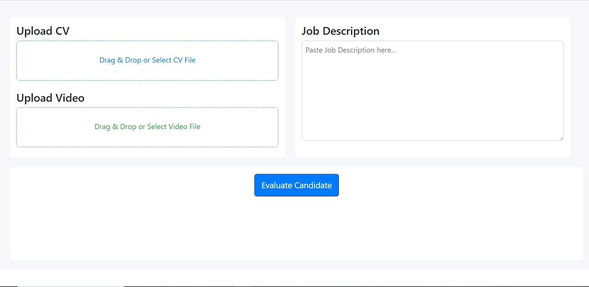
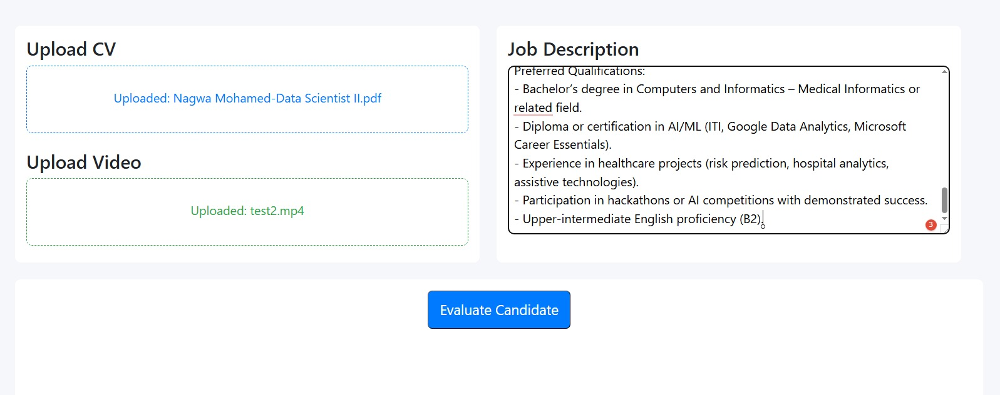
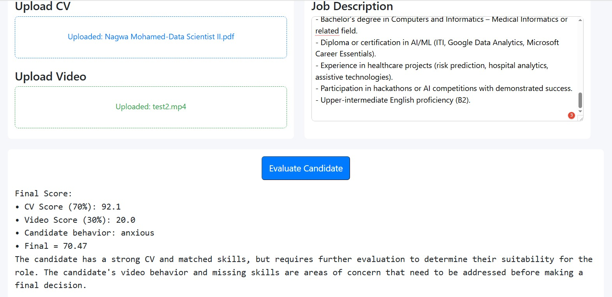

# Job-Matching-Candidate-Assessment-System

An end-to-end **AI-driven recruitment system** that evaluates candidates using **multi-modal analysis**:
- CV & Job Description matching using **Large Language Models (LLMs)**
- Skill extraction and quantitative scoring
- Video-based emotion and behavior analysis
- Final HR-style verdict generation

The system is designed as a **modular, production-ready Python project**, migrated from an experimental Jupyter Notebook into a clean architecture.

---

## 🚀 Key Features

- **CV Parsing & File Ingestion**
  - Supports PDF, DOCX, TXT, and image-based CVs
  - OCR fallback for scanned documents

- **LLM-Based CV–JD Matching**
  - Extracts required skills from Job Description
  - Extracts candidate skills from CV
  - Identifies matched and missing skills using semantic understanding
  - Calculates a quantitative CV score

- **Video Emotion Analysis**
  - Analyzes candidate interview videos
  - Detects dominant emotions using DeepFace
  - Computes confidence vs. anxiety scores

- **Final Candidate Verdict**
  - Combines CV score (70%) and video score (30%)
  - Generates a concise HR-style verdict using an LLM
  - Produces a final decision-ready report

- **FastAPI Interface**
  - REST API for evaluating candidates
  - Session-based result retrieval

---

## 🧠 System Architecture
```
CV / JD Files
│
▼
File Loader
│
▼
LLM CV Analysis
│
▼
Skill Matching & Scoring
│
▼
Emotion Analysis
│
▼                                        
Final Verdict Video  

```
---

## 📁 Project Structure
```
job-matching-system/
│
├── app/
│ ├── main.py 
│ ├── api.py 
│ │
│ ├── services/
│ │ ├── llm_model.py 
│ │ ├── cv_analysis.py 
│ │ ├── video_analysis.py 
│ │ └── verdict.py 
│ │
│ ├── utils/
│ │ └── file_loader.py
│ 
├── NoteBook/
│ └── job-matching-and-candidate-assessment-system.ipynb
│
├── requirements.txt
│ └── requirements-gpu.txt
└── README.md
```

---

## ⚙️ Technologies Used

- **Python**
- **FastAPI** – API layer
- **PyTorch** – Model inference
- **Transformers (Hugging Face)** – LLaMA Instruct model
- **DeepFace** – Facial emotion analysis
- **OpenCV** – Video processing
- **pdfplumber / pytesseract / docx2txt** – CV parsing & OCR

---

## 🤖 Language Model

- **Model:** `meta-llama/Llama-3.1-8B-Instruct`
- **Inference:** GPU-accelerated using PyTorch
- **Prompting:** Structured HR prompts for skill extraction and verdict generation

---

## 🖥️ Execution Environment

> **This project was executed and tested on:**
- **Kaggle Notebook**
- **GPU Runtime enabled**
- CUDA-supported environment
- PyTorch with GPU acceleration

This setup was required due to the size of the LLaMA model and the video analysis workload.

---

## ▶️ Running the Project

### 1️⃣ Install dependencies (GPU)
```bash
  pip install -r requirements-gpu.txt
```
### 2️⃣ Run the Core Pipeline
```bash
  python -m app.main
```
### 3️⃣ Run the API
```bash
  uvicorn app.api:app --host 0.0.0.0 --port 8007
```
## 📌 API Endpoints
  **POST /evaluate**
    Evaluates a candidate using CV, Job Description, and optional video.

 **GET /results**
   Retrieves evaluation results using a session ID.

## **🎯 Use Cases**

- **AI-assisted recruitment systems**

- **Automated candidate screening**

- **HR decision support tools**

- **Research in multi-modal AI evaluation**

 ## Demo

Simple link:
[Watch the demo (Google Drive)](https://drive.google.com/file/d/1TR_aMKeYHLdfkhCoNgLVXSG15J6Ocxox/view?usp=sharing) 

## Dashboard Screenshots

 
 
 


## 📄 License
This project is for educational and research purposes.
